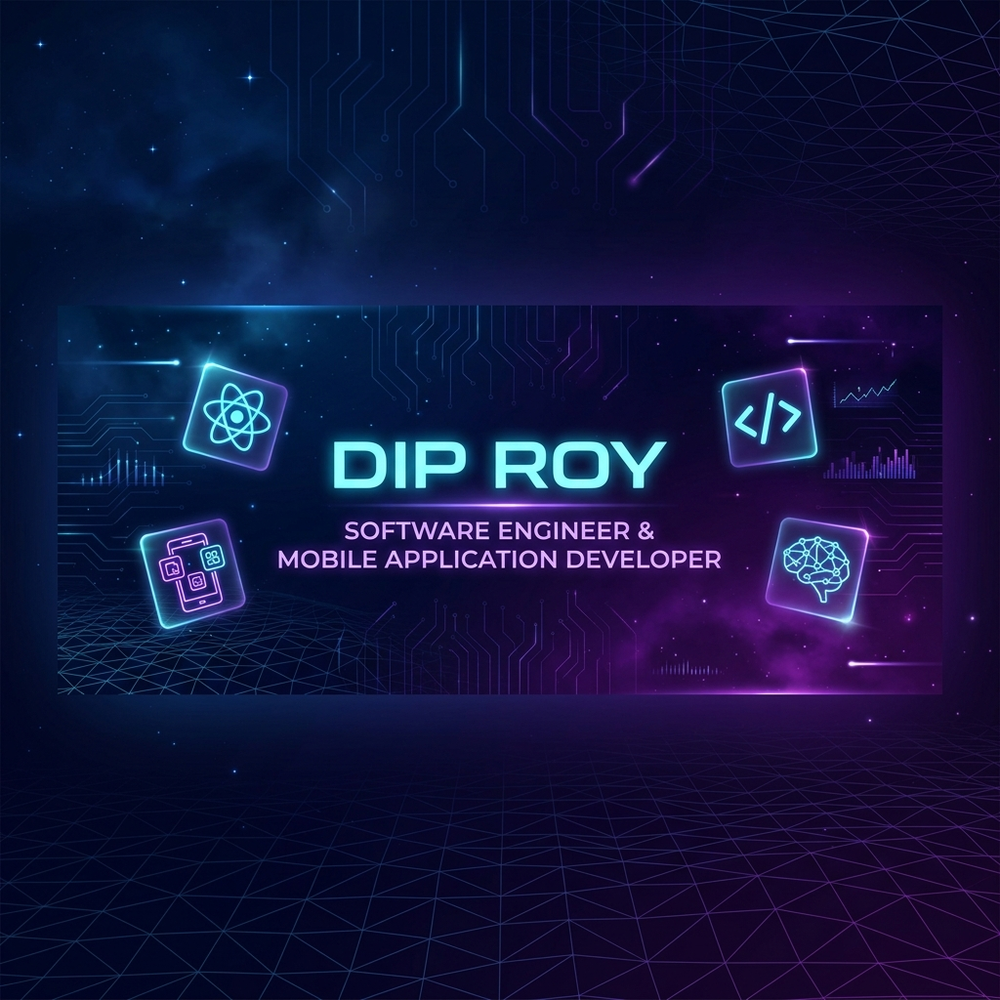

<p align="center">
  
</p>

<h1 align="center">
  
</h1>

<p align="center">
  <a href="https://github.com/diproylive">
    
  </a>
  <a href="https://komarev.com/ghpvc/?username=diproylive&color=0083b0&style=for-the-badge&label=Profile+Views">
    
  </a>
  <a href="https://github.com/diproylive?tab=repositories">
    
  </a>
</p>

---

### 💫 About Me

```javascript
const dipRoy = {
    code: ["JavaScript", "TypeScript"],
    mobile: ["React Native", "Android Architecture"],
    web: ["React", "HTML5", "CSS3", "Node.js", "Express.js"],
    database: ["MongoDB", "Firebase", "SQL"],
    architecture: ["Clean Architecture", "Scalable Systems", "REST APIs"],
    passions: ["AI-powered Apps", "Real-time Systems", "UX Optimization"],
    currentFocus: "Building high-performance mobile & web applications 🚀"
};
```

I build scalable, high-performance mobile and web applications with a strong emphasis on **clean architecture**, **delightful user experiences**, and **real-world problem solving**.

- 📱 **Mobile App Developer** — Crafting sleek, responsive cross-platform mobile apps
- ⚛️ **React Native Specialist** — Native feel with cross-platform efficiency
- 🌐 **Web Developer** — Building robust, interactive web interfaces
- 💻 **Software Engineer** — Writing clean, maintainable, production-ready code
- 🔧 **System Architecture** — Passionate about scalable & maintainable codebase patterns
- 🤖 **AI Explorer** — Integrating AI features into mobile & web ecosystems

---

### 🛠️ Tech Stack & Skills

<p align="center">
  <a href="https://skillicons.dev">
    
  </a>
</p>

<details>
<summary><b>🔍 Detailed Tech Stack Breakdown</b></summary>
<br />

| Category | Technologies |
| :--- | :--- |
| **Mobile Development** | `React Native` • `Android` • `JavaScript` • `TypeScript` |
| **Frontend Web** | `React` • `HTML5` • `CSS3` • `JavaScript (ES6+)` |
| **Backend & APIs** | `Node.js` • `Express.js` • `RESTful APIs` |
| **Databases** | `MongoDB` • `Firebase Firestore / Realtime DB` • `SQL (PostgreSQL/MySQL)` |
| **Tools & Environment** | `Git` • `GitHub` • `VS Code` • `Android Studio` |

</details>

---

### 📌 Featured Projects

<table>
  <tr>
    <td width="50%" valign="top">
      <h3 align="center">📱 The Global App</h3>
      <p align="center">
        
        
      </p>
      <p>A flagship mobile platform crafted with React Native, focused on seamless global connectivity, high efficiency, and clean UI architecture.</p>
    </td>
    <td width="50%" valign="top">
      <h3 align="center">🚚 Smart Logistics & Accessibility</h3>
      <p align="center">
        
        
      </p>
      <p>An intelligent logistics and accessibility platform streamlining real-time asset tracking, accessibility tools, and dispatch management.</p>
    </td>
  </tr>
  <tr>
    <td width="50%" valign="top">
      <h3 align="center">🤖 AI-Powered Applications</h3>
      <p align="center">
        
        
      </p>
      <p>Innovative applications leveraging modern artificial intelligence, smart automated workflows, and LLM integrations.</p>
    </td>
    <td width="50%" valign="top">
      <h3 align="center">💬 Real-Time Communication Apps</h3>
      <p align="center">
        
        
      </p>
      <p>High-speed instant messaging and audio/video sync applications built with WebSockets, Node.js, and MongoDB for low latency.</p>
    </td>
  </tr>
</table>

---

### 📊 GitHub Statistics

<p align="center">
  
  
</p>

<p align="center">
  
</p>

---

### 📈 Contribution Activity

<p align="center">
  
</p>

---

### 📱 Developer Showcase

<p align="center">
  
</p>

---

### 💬 Let's Build Something Impactful Together!

<p align="center">
  <a href="https://github.com/diproylive">
    
  </a>
  <a href="mailto:diproylive@gmail.com">
    
  </a>
  <a href="https://linkedin.com">
    
  </a>
</p>

<p align="center">
  
</p>
