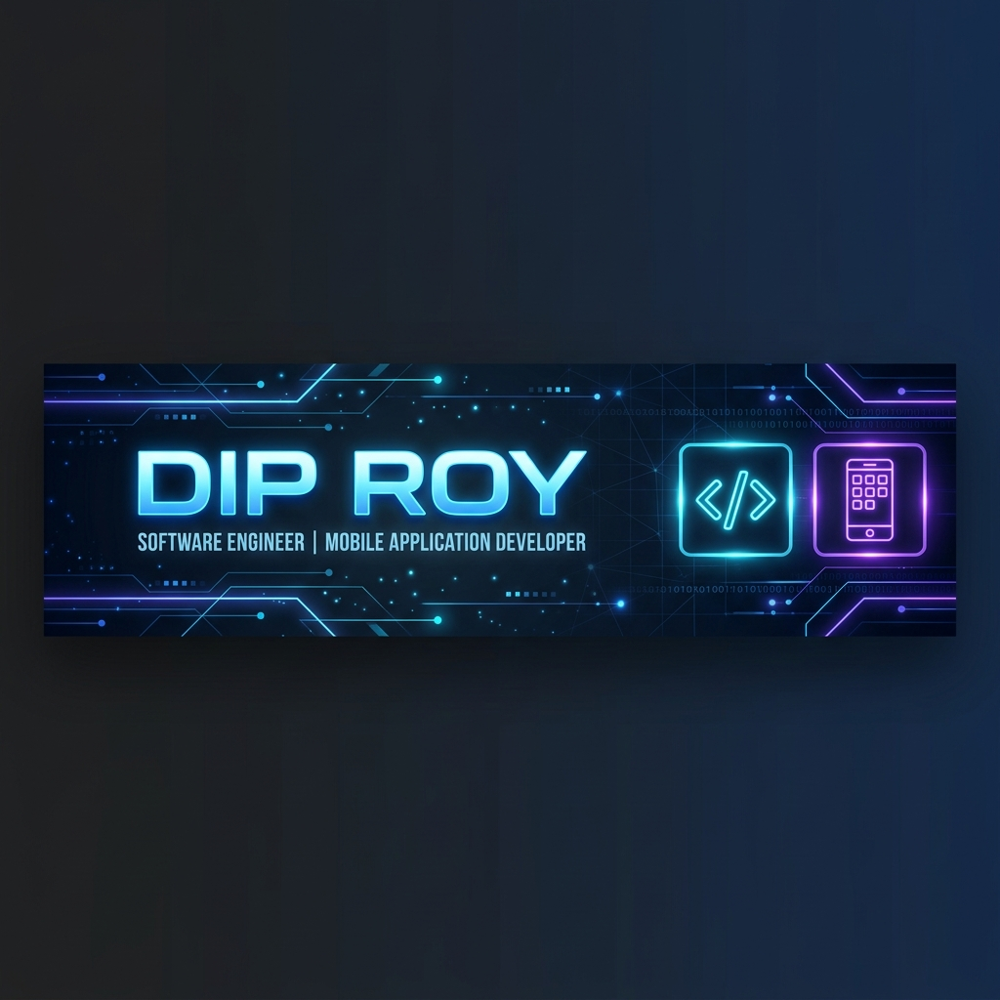

<p align="center">
  
</p>

<p align="center">
  
</p>

<h1 align="center">
  
</h1>

<p align="center">
  <a href="https://github.com/diproylive">
    
  </a>
  <a href="https://github.com/diproylive">
    
  </a>
  <a href="https://github.com/diproylive?tab=repositories">
    
  </a>
</p>

---

### 💫 About Me

```javascript
const dipRoy = {
    code: ["JavaScript", "TypeScript", "Python"],
    mobile: ["React Native", "Android Architecture"],
    web: ["React", "HTML5", "CSS3", "Node.js", "Express.js"],
    ai_ml: ["Machine Learning", "OpenCV", "AI Diagnostic Tools"],
    database: ["MongoDB", "Firebase", "SQL"],
    architecture: ["Clean Architecture", "Scalable Systems", "REST APIs"],
    passions: ["AI-powered Apps", "Real-time Systems", "Mobile Innovation"],
    currentFocus: "Building high-performance mobile & web applications 🚀"
};
```

I build scalable, high-performance mobile and web applications with a strong emphasis on **clean architecture**, **delightful user experiences**, and **real-world problem solving**.

- 📱 **Mobile App Developer** — Crafting sleek, responsive cross-platform mobile apps
- ⚛️ **React Native Specialist** — Native feel with cross-platform efficiency
- 🌐 **Web Developer** — Building robust, interactive web interfaces
- 💻 **Software Engineer** — Writing clean, maintainable, production-ready code
- 🤖 **AI Explorer** — Developing Machine Learning & AI-powered healthcare & web tools

---

### 🛠️ Tech Stack & Skills

<p align="center">
  <a href="https://skillicons.dev">
    
  </a>
</p>

<details>
<summary><b>🔍 Detailed Tech Stack Breakdown</b></summary>
<br />

| Category | Technologies |
| :--- | :--- |
| **Mobile Development** | `React Native` • `Android` • `JavaScript` • `TypeScript` |
| **Frontend Web** | `React` • `HTML5` • `CSS3` • `JavaScript (ES6+)` |
| **Backend & APIs** | `Node.js` • `Express.js` • `RESTful APIs` |
| **AI / ML & Vision** | `Python` • `OpenCV` • `Machine Learning` |
| **Databases** | `MongoDB` • `Firebase Firestore / Realtime DB` • `SQL (PostgreSQL/MySQL)` |
| **Tools & Environment** | `Git` • `GitHub` • `VS Code` • `Android Studio` |

</details>

---

### 📌 Featured Projects & Production Applications

<table>
  <tr>
    <td width="50%" valign="top">
      <h3 align="center">📱 The Global App</h3>
      <p align="center">
        
        
      </p>
      <p>Flagship mobile application built with React Native for seamless global connectivity, high performance, and intuitive UX.</p>
      <p align="center">
        <a href="https://play.google.com/store/apps/details?id=com.theglobal.app&hl=en_IN" target="_blank">
          
        </a>
      </p>
    </td>
    <td width="50%" valign="top">
      <h3 align="center">🎓 Skoolin App</h3>
      <p align="center">
        
        
      </p>
      <p>Intelligent school management and educational accessibility platform streamlining school activities and student communication.</p>
      <p align="center">
        <a href="https://play.google.com/store/apps/details?id=com.skoolin.myapp&hl=en" target="_blank">
          
        </a>
      </p>
    </td>
  </tr>
  <tr>
    <td width="50%" valign="top">
      <h3 align="center">🫀 HeartGuard AI</h3>
      <p align="center">
        
        
      </p>
      <p>AI-powered heart disease risk diagnostic web app utilizing clinical parameters, ML algorithms, and interactive symptom chatbot.</p>
      <p align="center">
        <a href="https://github.com/diproylive/HeartGuard_AI" target="_blank">
          
        </a>
      </p>
    </td>
    <td width="50%" valign="top">
      <h3 align="center">📦 React Native Simple Loader</h3>
      <p align="center">
        
        
      </p>
      <p>A customizable, lightweight loader and activity indicator component package for React Native mobile applications.</p>
      <p align="center">
        <a href="https://github.com/diproylive/react-native-simple-loader" target="_blank">
          
        </a>
      </p>
    </td>
  </tr>
  <tr>
    <td width="50%" valign="top">
      <h3 align="center">🚗 Driving School App (RN)</h3>
      <p align="center">
        
      </p>
      <p>Driving school management app featuring lesson scheduling, student tracking, and interactive test preps.</p>
      <p align="center">
        <a href="https://github.com/diproylive/Driving-School-App-RN" target="_blank">
          
        </a>
      </p>
    </td>
    <td width="50%" valign="top">
      <h3 align="center">⌨️ Typing Flow Desktop App</h3>
      <p align="center">
        
      </p>
      <p>Interactive desktop application designed for typing speed analysis and real-time accuracy diagnostics.</p>
      <p align="center">
        <a href="https://github.com/diproylive/typing-flow-desktop-app" target="_blank">
          
        </a>
      </p>
    </td>
  </tr>
</table>

---

### 📊 GitHub Statistics

<p align="center">
  
  
</p>

---

### 🔥 GitHub Streak

<div align="center">
  
</div>

---

### 📈 Live Contribution Activity Chart

<p align="center">
  
</p>

---

### 📚 Currently Exploring

```text
┌─────────────────────────────────────────────┐
│                                             │
│  🤖 Artificial Intelligence                 │
│  🏗️  System Design                          │
│  ⚡ Advanced React Native                   │
│  🌐 Scalable Backend Architecture           │
│  🎥 Real-Time Communication                 │
│  ☁️  Cloud & DevOps                         │
│                                             │
└─────────────────────────────────────────────┘
```

---

### 💼 Professional Profile

<div align="center">

**Software Engineer • Mobile Developer • Problem Solver**

Building applications that solve real-world problems.

<br/>

<a href="https://github.com/diproylive">
  
</a>

</div>

---

### 🤝 Let's Connect

<div align="center">

<a href="https://github.com/diproylive" target="_blank">
  
</a>

<a href="https://www.linkedin.com/in/dip-roy-56a256257/" target="_blank">
  
</a>

<a href="mailto:diproylive@gmail.com">
  
</a>

<a href="https://www.facebook.com/dipr00799" target="_blank">
  
</a>

<a href="https://www.instagram.com/dipr00799/" target="_blank">
  
</a>

</div>

---

<div align="center">

⭐ **Thanks for visiting my profile!**

If you like my work, consider giving my repositories a ⭐

<br/>


</div>
